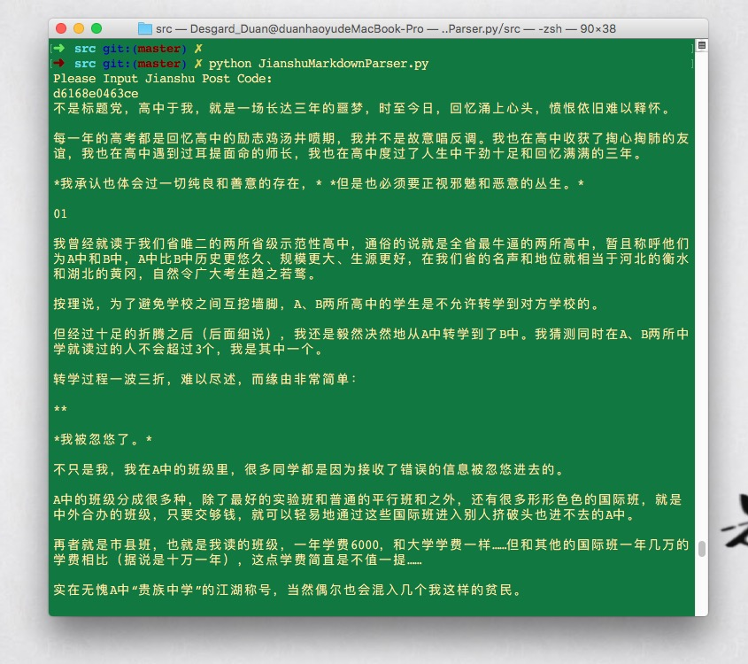

# JianshuMarkdownParser.py
从简书上将文章爬成krandom引擎md格式

---

## Screenshot

## Bugs

* `<li>`解析错误
* `<blockquote>`解析错误
* 复合语句解析错误，例如：`<h1>Hello <a href="http://desgard.com">World</a></h1>`
* `<pre>`语句对应Jianshu解析错误

