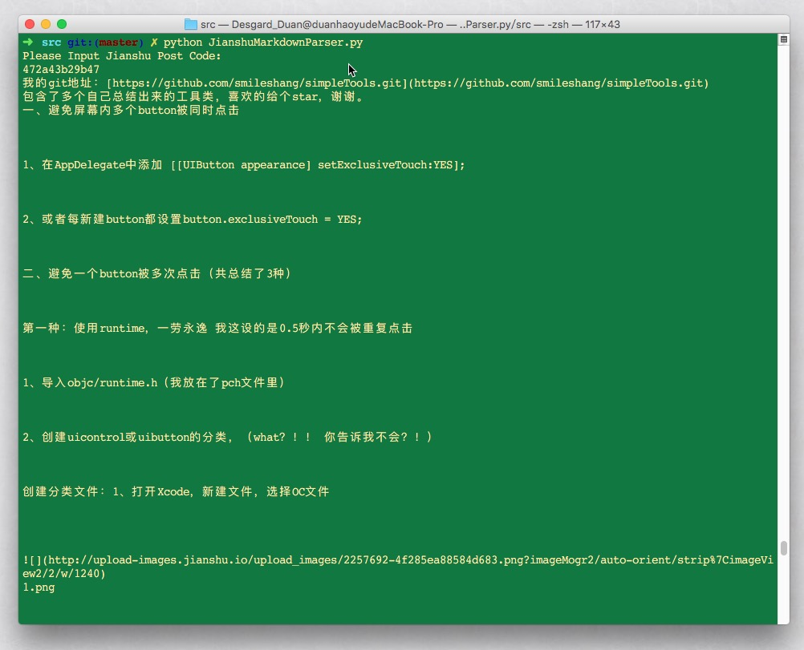

# JianshuMarkdownParser.py
从简书上将文章爬成krandom引擎md格式

---

## Screenshot

## Description

在简书上发布文章，进行文字爬取，生成`**.md`文件，可同步至[瓜地](http://desgard.com)。

## Next Mission

* 爬取文章基本信息
* 自动生成格式化文件名：`yyyy-MM-dd-{title}.md`
* 本地创建文件

